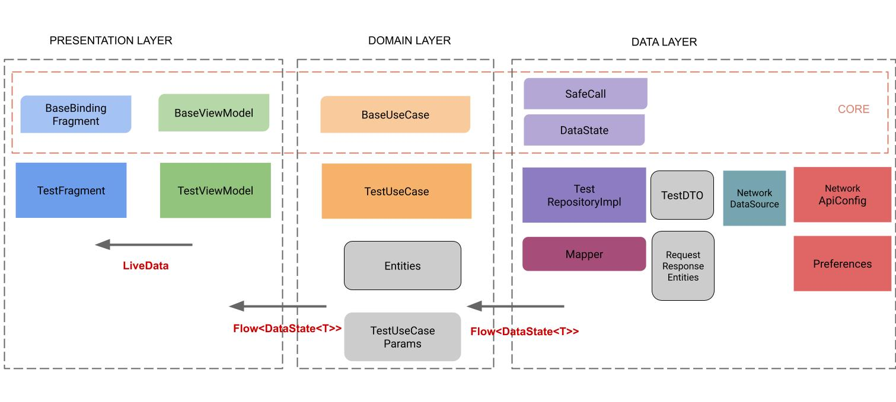
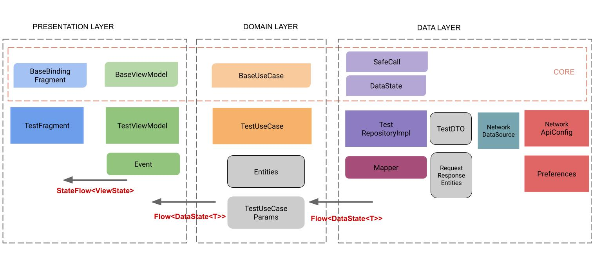
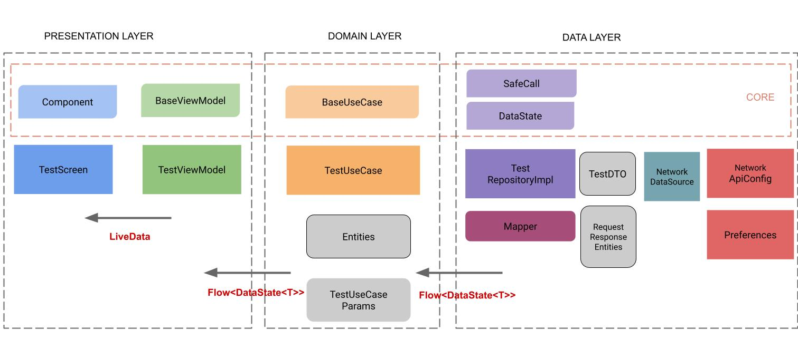

# Android Flow
Ejemplos de arquitecturas Android MVVM basados en Flow.

## Proyecto Notas
### NetworkApp:
[NetworkApp](https://github.com/FahedHermoza/reviewArchitectures/tree/main/KoinNetworkKotlinApp): Construido con arquitectura Clean, patron MVVM, Android Jetpack (navigation, lifecycle, livedata, preference), Coroutines (Flow) y algunas librerias ( retrofit, preferences, timber). 

#### Configuración de backendless, necesario para correr la app de prueba:
1. Crear una nueva cuenta en backendless.
2. Configurar de acuerdo al siguiente video: [Tutorial](https://drive.google.com/file/d/19Ow_9vZXwS824_zlJb0f7ItCqoFr7iGv/view?usp=share_link).

#### Credenciales de inicio de sesión
Usuario: admin@admin.com
Password: 12345admin

### StorageApp:
[StorageApp](https://github.com/FahedHermoza/ArchitectureAndroid-Flow/tree/main/KoinStorageKotlinApp): Construido con arquitectura Clean, patron MVVM, Android Jetpack (room, navigation, lifecycle, livedata), Coroutines (Flow) y algunas librerias (koin, timber, junit, mockito).

### Diagrama de Arquitectura:

        
        

### Usos de FLow:
- Permite transmitir informacion entre las diferentes capas de Clean. Desde la capa de Data -> Domain -> Presentation.
- Permite recibir notificaciones de cambios en su base de datos usando "Lecturas observables" a traves de Flow y Room(version 2.2 o superior).
- Permite que cualquier View observe cambios en datos relevantes en el ViewModel y actualice la UI, a traves de StateFlow.

## Variante: Unidirectional data flow
[StorageApp](https://github.com/FahedHermoza/ArchitectureAndroid-Flow/tree/main/Variante-1): Implementacion intermedia entre MVVM y MVI, utilizando ViewState y Event en el ViewModel, tambien se utilizo StateFlow en vez de LiveData. También se uso la libreria Turbine para Unit Test.

**ViewState:** Clase que almacena el estado actual de su vista. Lo emites a traves de un LiveData o State Flow (state).

Representado por:
- Data Class
- Sealed Class

**Event:** Los eventos son acciones que desencadena la UI.

Representado por:
- Sealed Class

**StateFlow:** Flujo observable contenedor de estados que emite actualizaciones de estados actuales y nuevas a sus recopiladores.

| Descripción | LiveData | StateFlow |
|:-------------------:|---|---|
| Contenedor de datos observables | YES | YES |
| Patron de diseño: OBSERVER | YES | YES |
| Requiere estado inicial en el constructor | NO | YES |
| Dar de baja al consumidor cuando la View pasa a STOPPED | AUTOMATIC | MANUAL (lifecycle.repeatOnLifecycle) |

### Diagrama de Arquitectura:

        
        

## Variante: Jetpack Compose
[StorageApp](https://github.com/FahedHermoza/ArchitectureAndroid-Flow/tree/main/Variante-2): Implementacion cambiando la capa de presentacion con la libreria Jeckpack Compose y Navigation Compose.

**Jetpack Compose:** Se ha vuelto más fácil crear UI en tiempo de ejecución en lugar de definir una UI estática que pueda rellenarse con datos. En la mayoría de los casos optimizas el tiempo de desarrollo y la facilidad de mantener código. 
- El [radar de thoughtworks](https://www.thoughtworks.com/es-es/radar/languages-and-frameworks/jetpack-compose) sugiere adoptarlo desde 2021 (Martin Fowler - Chief Scientist).
- Tendencia en el mercado construir Interfaces Declarativas (SwiftUI, Flutter, React).

### Diagrama de Arquitectura:

        
        

## Diapositivas
Puedes encontrar las diapositivas en el siguiente [enlace](https://docs.google.com/presentation/d/1Vaa4ZGt65bbbijyIJlr7RYH1Llod4wq1aoitug7k2Js/edit?usp=sharing).

## Créditos
Este repositorio es posible gracias a **Eduardo Medina** de hecho el repositorio esta basado en uno de sus proyectos base y **Jhonatan Sandoval** por la guia de la arquitectura basada en flows.
